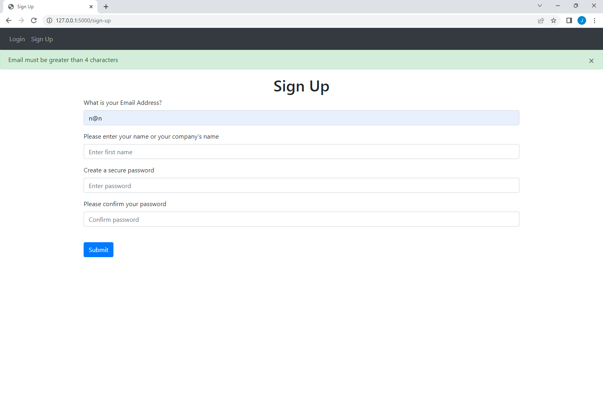

 

# This README file contains:
-Purpose of the project  
-Instructions for running the website 
-Instructions for changing styling elements  
## Project Purpose:

The purpose of this project is to create an reliable line of communication between Global Village Foods and farmers/food suppliers.  

## Instructions:

1. Ensure you are connected to the internet.

2. Ensure your environment variables are properly configured.

3. Ensure that http://127.0.0.1:5000/ and http://127.0.0.1:8080/ are available. 

4. Execute  "init.py", "views.py", "auth.py" and then "main.py". Then, inside the "REST_API" folder, execute "main.py".   
 

## How to change styling elements:

1. Base.html contains all styling elements in Bootstrap, the CDN of choice for these web pages.

2. To change the navbar, go to https://getbootstrap.com/docs/4.3/components/navbar/ 

3. If the above link does not work, go to https://getbootstrap.com/docs/ , search for Components and click on Navbar.

4. To change the Bootstrap version, go to https://getbootstrap.com/docs  and click on Introduction. Then copy and paste the HTML+JS.

5. For all other styling elements, follow proper HTML styling guidelines.

6. If the app is being launched into production, change the debug parameter from "false" to "true" inside website's "init.py" file.   

## Project Photos:

